

  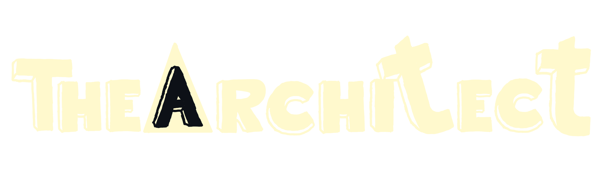

### Hey 👋

Building things, breaking systems, and learning from the chaos.

And passionate about building software, exploring new technologies, and turning ideas into reality.

---

# About me

> **If I had to describe myself in one sentence...**

  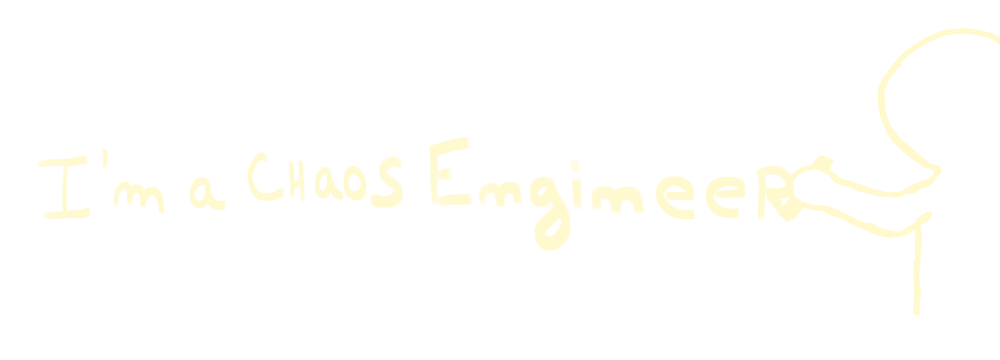

# Skills

  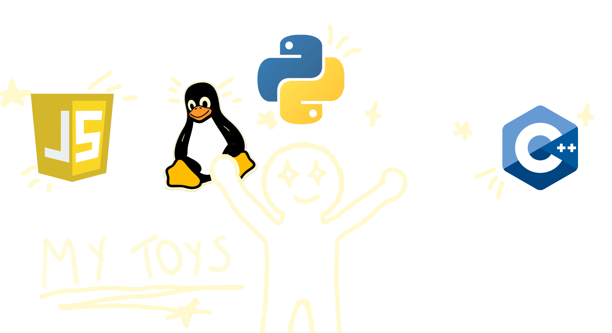

# Projects

  <a href="https://github.com/0xthearchitect/NataBase">
    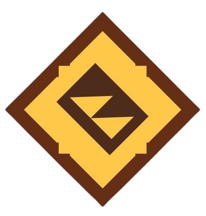
  </a>
  <a href="https://github.com/0xadamastor/C.A.L.M.A.">
    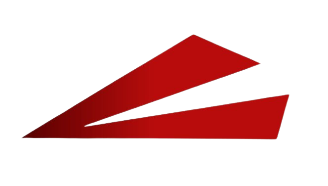
  </a>
  <a href="https://github.com/0xthearchitect/cromometro">
    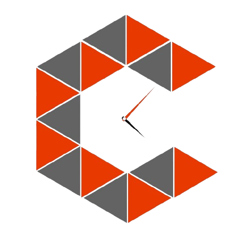
  </a>
  <a href="https://github.com/0xthearchitect/mimic">
    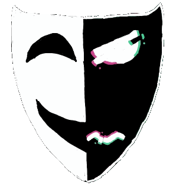
  </a>

### But... what is this?

  <a href="https://github.com/0xthearchitect/beatrooter">
    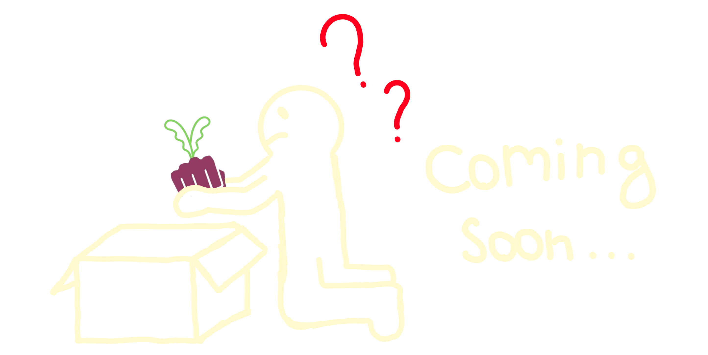
  </a>

# Team

<table>
<tr>
<td width="150">

</td>
<td>

<b>DevilBoy</b>

A man as full of ideas as he is of experience.
He points us in the right direction and takes care of everything that is democratically boring.
He says he has no skills, but honestly, putting up with us is already a huge skill in my opinion.

Thanks Rodrigo, for putting up with us.

</td>
</tr>

<tr>
<td width="150">

</td>
<td>

<b>0xAdamastor</b>

Why is Rafa important to the team?
Well... he... is a good person.

Just kidding. He’s our professional system breaker.
He finds more vulnerabilities than girlfriends!

My favorite Q&A 💋

</td>
</tr>

<tr>
<td width="150">

</td>
<td>

<b>0.1</b>

There’s no one more creative than this guy (there probably is, but he’s on my team so I have to hype my team up 🙃).
He’s also the creator of our name, logos, and most of the designs we use on our websites and apps.

Metal is for grown-ups, but my little Zézinho is the exception. 🤘

</td>
</tr>

</table>

# Connect Me

  <a href="https://www.instagram.com/0xthearchitect">
    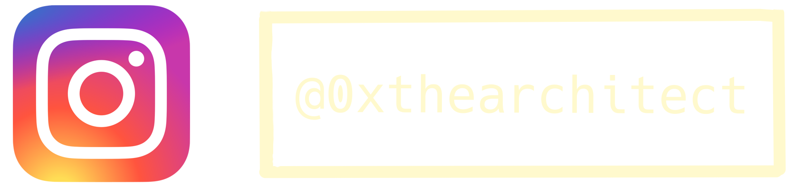
  </a>

  <a href="https://www.linkedin.com/in/0xthearchitect">
    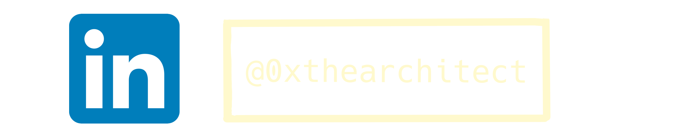
  </a>

  <a href="https://0xthearchitect.github.io">
    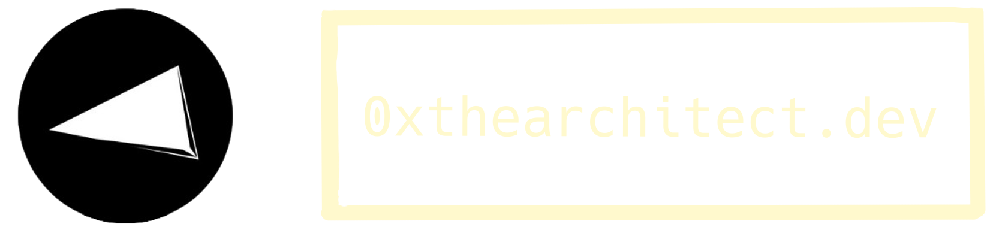
  </a>

